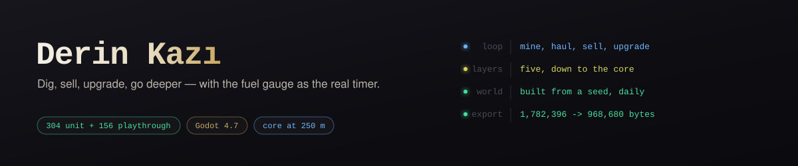

# Derin Kazı

*Side-view digging and upgrade loop (Godot 4, Turkish UI): take the drill rig down, haul ore back before the fuel runs out, sell, upgrade, reach the core at 250 m. Fog of war, earthquakes you can read coming, a one-shot teleport marker. 304 unit + 156 playthrough + 17 balance checks, and a bot that has to reach the core on 12 of 12 seeds.*

[](https://github.com/Furkiozknn/derin-kazi/actions/workflows/ci.yml)

Yandan kesit görünümlü kazı + gelişim oyunu: matkaplı araçla yeraltına in, maden
topla, yakıt bitmeden yüzeye dön, sat, aracını geliştir, 250 m'deki çekirdeğe ulaş.


Durum: **v0.7.2** — MIT lisansı, her push'ta **304 birim + 156 oynanış + 17 ölçüm**
testinin ve fay hattı kapısının koştuğu CI, ve oyuncuya inen web paketinin **1.782.396 → 968.680 bayta** inmesi (iç
klasörler dışa aktarmadan çıkarıldı). Oynanış v0.7 ile aynı.

**Oyunda ne var:** beş katmanlı kazı-sat-geliştir döngüsü ve 250 m'deki çekirdek,
yakıtın sayaç olduğu iniş-çıkış kararı, keşif sisi, okunabilen depremler, tohum
kodundan kurulan günlük dünya ve Derin Mod, tek kullanımlık ışınlama işareti,
bitiş ekranında istatistik dökümü.

Windows + Web çıktısı alınıyor; yayın paketi `yayin/` altında hazır
(**yüklenmedi**).

Sürüm sürüm ne değiştiği: **[SURUM-GECMISI.md](SURUM-GECMISI.md)** · güncel sürümün
notları [Releases](https://github.com/Furkiozknn/derin-kazi/releases) sayfasında.

## Kontroller

| Tuş | Gamepad | İş |
|---|---|---|
| `A` / `D` veya `←` / `→` | Sol çubuk, D-pad | Yürü; zemindeyken yana kaz |
| `S` veya `↓` | Aşağı | Aşağı kaz |
| `W` / `Boşluk` | A | Pervane — boş tünelde yüksel |
| `E` | X | Üs menüsü (sat, geliştir, yakıt, müze) |
| `T` | RB | Işınlanma (yüzey ↔ istasyon ↔ işaret) |
| `R` | B | Dönüş işareti koy (yeraltında, tek kullanımlık) |
| `Q` | LB | Maden radarı |
| `F` | Y | Dinamit (3×3) |
| `M` | Back | Mini harita |
| `Esc` | Start | Duraklat / ayarlar |

Dokunmatik cihazda ekranın alt sol / alt sağ / alt orta bölgesine dokunmak o yöne
kazar, üst ortadaki alan pervanedir. Klavye olmadığı için sağ üstte üç düğme var:
**Üs** · **Harita** · **■** (duraklat); solda, ◀ alanının üstünde dikey üç
alet düğmesi: **DİNAMİT n** (sayaçlı, dinamit yokken sönük) · **RADAR AÇ/KAPA**
(radar alınmamışsa sönük) · **İŞARET KOY** (konunca derinliğini yazar). Menüdeki
yardım, oyun içi ipuçları ve mağaza satırları dokunmatik cihazda kendiliğinden
düğmeleri anlatır (`docs/oyun-telefon.png`).

**Yukarı kazma yok.** Yükselmek için pervaneyle kendi açtığın tünelden çıkarsın —
geri dönüş yolunu düşünerek kazmak oyunun ana gerilimi.

## Oyun döngüsü

1. Üsten aşağı kaz. Her katmanın kayası bir öncekinden sert.
2. Yük dolunca ya da yakıt azalınca üsse dön, sat, geliştir.
3. Bir sonraki katmanın kapısı matkap seviyesi ister: "Matkap Sv2 gerekli".
4. 250 m'deki **çekirdeğe** dokun → tüm aletler açılır, yüzeye zamanlı kaçış.

### Beş katman

| Derinlik | Katman | Maden | Tehlike | Gereken matkap |
|---|---|---|---|---|
| 0–40 m | Toprak | Bakır (10 ₺, 1 ağırlık) | Gevşek kaya | Sv1 |
| 40–90 m | Taş | Demir (25 ₺, 2) | Gaz cebi | Sv2 |
| 90–150 m | Sert Taş | Altın (62 ₺, 4) | Gevşek kaya | Sv3 |
| 150–210 m | Bazalt | Elmas (117 ₺, 6) | Lav | Sv4 |
| 210–250 m | Çekirdek Kabuğu | Platin (240 ₺, 10) | Lav | Sv5 |

### Geliştirmeler ve aletler

- **Matkap / Yakıt deposu / Yük kasası / Gövde zırhı** — 5 seviye,
  fiyat `taban × 1,35^seviye`.
- **Maden radarı** (`Q`) — en yakın madenin yönünü ve uzaklığını HUD'a yazar;
  açıkken keşif sisini 9 karo yarıçapta **geçici** seyreltir (keşif saymaz).
- **Isı kalkanı** — lav yakınında hasar almazsın.
- **Dinamit** (`F`) — 3×3 patlatır, sarf malzemesi.
- **İstasyon kiti** (`T`) — 40 m'den derinde, 50 m aralıkla kurulur; istasyon ile yüzey arasında
  anında yolculuk.
- **Kazı zinciri** — art arda aynı madeni toplayınca çarpan yükselir (3/5/8 adette
  ×1,25 / ×1,6 / ×2,0; 6 sn içinde aynı madeni bulamazsan sıfırlanır), toplama
  sesinin perdesi de tizleşir (`Ayarlar.ZINCIR_*`).
- **Gizli oda sandıkları** — eser çıkmayan odalarda para (40–120 ₺), dinamit (2–4)
  ya da yakıt (30–70) verir; ödül hücreden türer, aynı sandık hep aynısını verir.
- **Eserler** — gizli odalarda bulunur, müzeye gider, kalıcı pasif bonus verir.
  Altı eserin her biri çekirdeğin sırrından bir parça anlatır; 1'den 6'ya doğru
  okununca tek bir hikâye çıkar. **7. eser** ("Uyanmış Kabuk Parçası", ışık +1)
  yalnız Derin Mod'da, ilk gizli odada bulunur — hikâyenin sonrası.

### Keşif sisi (v0.5)

Yeraltında yalnız gördüğün yer aydınlık. Aracın ışığı 5 karo yarıçapı **kalıcı**
açar (kenarı yumuşak), gezilmiş ama ışık dışında kalan yer loş bir "hatıra",
hiç gezilmemiş yer kapkaranlık; ilk 8 m'de gün ışığı sisi eritir. Işık **yakıt
harcamaz** — sis bir kaynak yönetimi değil, bir bilgi kısıtı. Radar açıkken 9
karo yarıçap geçici seyrelir. Mini harita yalnız keşfedileni boyar; keşif kayda
sıkıştırılmış yazılır, v0.4 kaydı açılınca kazılmış tünellerin çevresi
keşfedilmiş sayılır (kapkaranlık başlamaz). Madenler ve gaz cebi deseni ışığın
içinde olduğu gibi görünür: örtü ışığın içinde sıfır.

### Derinlik ambiyansı (v0.6)

Dört bant: **toprak** (0–40 m) → **kaya** (40–150) → **bazalt** (150–210) →
**çekirdek kabuğu** (210+). Her bandın kendi parçası var (`muzik` gizemli,
`muzik_derin` gergin, `muzik_bazalt` gergin/160 bpm, `muzik_cekirdek` — v0.6'da
müzik üreticiye eklenen ikinci yeraltı ruhu: 68 bpm, frigyen, davul yerine kalp
atışı) ve sınırı geçince iki oyuncu 1,6 sn çaprazlanır; parça hiç kesilmez,
sınırda gidip gelince baştan başlamaz. Parçalar açılışta belleğe alınır (web'de
sınırda `load()` takılması yok). Sığ bantlarda havada süzülen toz, derinde
yukarı süzülen kıvılcım (araca bağlı `CPUParticles2D`, sisin altında çizilir);
düz arka plan bandın tonuna, kaya dokusu katmanın rengine yumuşak kayar.

### Sunum turu ve ışınlama işareti (v0.7)

- **Yüzey karosu.** 0. satırın toprağı ayrı bir atlastan (`yuzey.png`, 4 varyant)
  çizilir: çimen bandı, ince kum sınırı, üstte gökyüzüne açılan yaprak ve çukurlar.
  v0.6'ya kadar yüzeyle gök arasındaki birleşim ekran boyunca dümdüz tek çizgiydi.
  Karo türü değişmedi — üretici, kazı ve kayıt hâlâ TOPRAK görür.
- **Araç ara kareleri.** `arac.png` 9 kare: bekle · 2 kazma · 3 **palet** · 3
  **pervane alevi**. Palet yolla döner (hız × süre / 3 px): hızlı araçta hızlı,
  duran araçta durur; yön aynalamadan gelir. Alev 12 kare/sn, boy ve çekirdek
  değişir. Kare seçimi saf; bot ve ölçümler kareyi bilmez.
- **Matkap döngü sesi.** Kazı başlayınca 0,6 sn'lik dikişsiz döngü çalar (motor 55 Hz
  + uç takırtısı + öğütme), kesilince 0,3 sn kuyrukla söner — karo arası düşüşte
  kesilip baştan başlamaz; perde matkap seviyesiyle tizleşir. **Deprem gürültüsü**
  ayrı dosya: açılış vuruşu, 15-60 Hz sarsıntı, çatırtı, 2,8 sn; uyarı anında aynı
  ses tiz ve kısık. İkisi `tools/ses_uret.gd` ile sentezlenir, aynı tohum aynı
  baytları verir. Patlama sesi gaz, dinamit ve çekirdek için kaldı.
- **Bitiş istatistiği.** Panel bu dünyanın dökümünü (kazılan karo, deprem, yüzeye
  çekilme, satış toplamı, süre) ve bütün dünyaların `[oyuncu]` toplamını yazar;
  480 px'e sarılır, 640×360'a sığar (536×296, testli). Toplam yuva silinse de kalır.
- **Işınlama işareti.** Yeraltında `R` (gamepad B, dokunmatikte İŞARET düğmesi)
  aracın hücresine tek kullanımlık dönüş noktası koyar; yenisi eskisini taşır.
  Işınlanma panelinde "İşarete ışınlan — N m" satırı çıkar, asansör kuralı aynı:
  üsten ya da bir istasyondan gidilir, gidince silinir. Deprem işaretin hücresini
  kapatmışsa varışta açılır. Eski kayıt işaretsiz açılır; bot işareti bilmez.

### Canlı yeraltı (v0.3) ve depremin kararı (v0.4, pano v0.5)

Her **5 seferde** (in-çık; Derin Mod'da **4**) bir deprem olur. Yeraltındayken önce **geri sayım**
başlar — kırmızı ekran işareti + ses, sarsıntı, ekranın üst-ortasında üç satırlık
pano: `DEPREM 7.4 sn` / `W ile YÜZEYE ÇIK → +… ₺ ikramiye` / `DERİNDE KAL → …
hasar` (son 3 saniyede sayaç yanıp söner; dokunmatikte `▲ UÇ ile`) — sonra:

- eski tünellerin ~%22'si kapanır (`Deprem.KAPANMA_ORAN`),
- kalan tünellerin duvarlarında **yeni gaz cepleri ve maden damarları** belirir.

**Uyarı bir bahis (v0.4).** Süre derinlikle uzar (4 sn + derinlik × 0,06;
100 m'de 10 sn, 250 m'de 19 sn, tavan 20 sn) — ki karar verilebilsin. Sonra:

- **yüzeye çıkarsan** (12 m ve daha sığ) **kabuk nöbeti ikramiyesi** alırsın:
  25 ₺ + uyarı anındaki derinliğin. 100 m'den dönene +125 ₺.
- **derinde kalırsan** hasar yersin: 1 can, 100 m'den derinde 2. Tavan 2 —
  deprem **tek başına** bir koşuyu bitiremez.
- **hızlı düşersen** ayrıca canından gider: 250 px/sn üstünde yere çarpmak 1 can
  (`Ayarlar.DUSME_HASAR_HIZ`) — depremden bağımsız, her koşuda geçerli.
- **kurduğun bir istasyondaysan** ışınlanıp ikramiyeyi bedavaya alırsın.
  İstasyonun ikinci gerekçesi bu.

Gerekçe rakip analizinden: Dome Keeper'ı tutan şey dalga sayacının kurduğu
"bir blok daha kazayım mı?" gerilimi. v0.3'te deprem saf bir olaydı — oyuncunun
verecek bir kararı yoktu. Hesap `Deprem.karar/odul/hasar/uyari_suresi` içinde
saf tutuldu: derinlik girer, sözlük çıkar; sahne gerekmez, test doğrudan sınar.

Üç kural kodda garanti altında (`scripts/deprem.gd`, testleri var):
aracın / üssün / istasyonların çevresine dokunulmaz · kapanan hücre **her zaman**
kazılabilir taban kayasıyla dolar, asla kazılamaz kaya ya da lavla değil ·
ilk 10 m hiç değişmez. Yani deprem seni hiçbir zaman kapalı bir boşlukta
bırakmaz; en kötü ihtimalle kendini yeniden dışarı kazarsın.

### Tohum kodu, günlük dünya, Derin Mod (v0.3)

- **Tohum kodu** — menüdeki "Tohum kodu" ekranı dünyanın 7 harflik kodunu
  gösterir ve başkasının kodunu almana izin verir. Alfabede `I`, `O`, `0`, `1`
  yok (elle yazarken karışıyor) ve kodun 3 bitlik sağlaması var: yanlış yazılan
  kod sessizce başka bir dünya açmaz, "geçersiz" der (tek harf hatalarının %87'si).
- **Günlük dünya** — tohum tarihten türer, herkeste aynıdır. **Ayrı kayıt yuvası**
  kullanır (`[gunluk]`), ana ilerlemene dokunmaz. Menüde o günün en derin noktası
  yazar; gün değişince yuva sıfırlanır.
- **Derin Mod** — çekirdeği bir kez çıkardıktan sonra menüde açılır. Yeni tohum,
  sıfırlanan geliştirmeler, **korunan eser bonusları** ve her turda artan zorluk:
  kaya %15 daha sert, yakıt %12 daha hızlı biter, maden %25 daha değerli.
  **v0.6'dan beri başka bir yer:** ışık 3 karo (ilk oyunda 5), deprem 4 seferde
  bir, ilk gizli odada yalnız burada bulunan **7. eser** (ışığa bir karo geri
  verir), sağ üstte **rozet**. **Kendi kayıt yuvası** (`[derin]`): ana dünya
  (çekirdeği çıkarılmış, tünelleriyle) yerinde kalır; süren tur "devam et",
  biten tur bir üst seviyeyi yeni tohumla kurar. v0.5'te Derin Mod ana yuvanın
  üstüne yazıyordu — öyle bir kayıt olduğu gibi açılır ve "Başla" ile sürer.
  İnsan benzeri bot Derin Mod x1'i 7 tohumda ölçtü: tur 122 sn (+16), çekirdek
  24 dk, 7/7 varış, 18 deprem.

## Verilen kararlar

- **Oturum uzunluğu: ilk oyun ~25 dk, uzun kuyruk Derin Mod'da.** Rakip
  analizindeki "çekirdeğe 60-90 dk" hedefi v0.3'te bilerek bırakıldı. Aynı
  analizde Motherload'ın şikâyeti "çok uzun, aynı şey farklı derinlik", A Game
  About Digging A Hole'ün şikâyeti "1-2 saat ve geliştirmeler erken bitiyor".
  İnsana benzetilmiş bot 7 tohumda çekirdeğe **25 dakikada** varıyor
  (`tests/test_insan.gd`); tur süresi 106 sn (v0.4 ölçümü: deprem kararı ve
  botun BFS rotası dahil). Bir oturumda bitirilebilen bir
  oyun + tekrar oynanabilir Derin Mod, 90 dakikalık bir tırmanıştan daha iyi bir
  bahis. Sayı kaymasın diye test bant bekçisi olarak duruyor.
- **Garantili fay hattı — yolu var etmek için değil, bulunabilir kılmak için.**
  Üsten çekirdeğe inen, kıvrımlı, 3 karo genişliğinde bir koridorda **asla**
  kazılamaz kaya ya da lav üretilmiyor; içi sıradan kaya ve madenle dolu, yani
  oyuncu koridoru göremiyor. Ölçüm (`tests/test_fay_olcum.gd`) beklediğimizi
  düzeltti: **fay kapalıyken de** 12 tohumun 12'sinde yüzeyden çekirdeğe
  kazılabilir bir yol vardı (BFS). Sorun yolun yokluğu değil, "aşağı kaz,
  tıkanınca yana git" diye oynayan birinin onu bulamamasıydı: aynı 12 tohumda
  v0.3'ün kör botu fay kapalıyken **8/12**, açıkken **11/12** varıyordu; v0.4'ün
  BFS'li botu fay açıkken **12/12** varıyor ve `tests/test_fay_olcum.gd` bunu
  geçme koşulu olarak sınıyor.
  Dome Keeper şikâyeti ("kötü dünya üretimi oyunu bitirilemez yapıyor") bu
  oyunda dünyanın bitirilemez olmasıyla değil, geçilemeyecek kadar dolambaçlı
  olmasıyla ortaya çıkardı.
- **Karo varyantları doku, dünya değil.** Atlasın 5 satırı var. Taban kayaları
  için satır hücrenin konumundan türer (tohumdan değil), **maden karoları için
  satır = KATMAN**: damarın zemini bulunduğu derinliğin kayasıdır. Tehlike
  karolarının varyantı yok — gazın deseni bir bakışta tanınmalı.
  Asıl kusur dokunun tekrarı değil, her karonun üstte açık altta koyu olmasıydı:
  duvar 16 px'de bir çizgileniyordu. Degradenin karşıtlığı düşürüldü ve varyantlar
  arasında **yön değiştiriyor**.
- **Simgeler için ayrı yazı tipi.** Godot'nun gömülü yazı tipinde `₺ ← ↑ → ↓ ▲ ▶
  ▼ ◀ ✔ ■` yok. Masaüstünde sistem yazı tipi örtüyor, **web'de örtmüyor** — orada
  simge yerine içinde onaltılık kod yazan kutu çıkıyordu. `assets/fonts/simgeler.ttf`
  `Ses` autoload'unda yedek yazı tipi olarak zincire ekleniyor; test kodda geçen
  bütün simgeleri tarıyor.

- **Maden ağırlığı var.** Elmas bakırdan 12 kat değerli ama 6 kat ağır. Kasa
  kapasitesi ağırlık sayar. Görevdeki "katman başına gelir ~×1,5" hedefini
  tutturan ayar bu: yalnız değeri büyütseydik gelir katman başına ×2'nin üstüne
  çıkıyor ve oyun 6 turda bitiyordu (simülasyon bunu ölçtü).
- **Yakıt bitince ölüm yok.** Araç yüzeye çekilir, derinlikle artan bir çekme
  ücreti alınır, yükün yarısı olduğu yerde sandık olarak kalır ve geri alınabilir.
  Sert ceza "bir tur daha" hissini öldürüyor (rakip analizi).
- **Deponun %30'u üste dönünce bedava dolar**, üstü ücretli. Yakıt hâlâ bir
  kaynak ama parasız + yakıtsız kilitlenme yok. Bu kural denge simülasyonu
  oyuncuyu 88 m'de 0 gelirle sonsuza kadar takılı bıraktığı için eklendi.
- **Işınlanma yalnız üste ya da bir istasyona basarken çalışır.** Her yerden
  anında kaçış olsaydı yakıt gerilimi tamamen kalkardı; istasyon kurmak da
  gerçek bir yatırım olmazdı.
- **Kazılan hücreler kaydediliyor.** Dünya 16×16 chunk; yalnız aracın çevresindeki
  3×3 chunk `TileMapLayer`'da duruyor, kırılan karolar `Dictionary` farkı olarak
  tutuluyor. Oyun kapatılıp açılınca tüneller yerinde kalıyor.
  Ölçüm: 64×272 = 17.408 karonun ~1.400'ü bellekte, **32 MB statik bellek**.
- **Lav mağara boşluğunun yerine konuyor**, kayanın değil. Böylece kazılamaz
  olmasına rağmen hiçbir yolu tıkamıyor; test yüzeyden çekirdeğe kazılabilir bir
  yol olduğunu her tohumda doğruluyor.
- **Maden damarının zemini bulunduğu katmanın kayası (v0.4).** v0.3'te zemin her
  katmanda aynı nötr koyu taştı — gerekçe "bakır bazaltın içinde de çıkabiliyor"
  idi, ama sonuç toprak katmanında duvara yapıştırılmış **mavi-gri bir kare**
  oldu. Çözüm tek bir zemin seçmek değil, zemini derinliğe bağlamak: atlasın
  satırı artık katman. Bakır toprakta kahverengi, bazaltta gece mavisi bir
  zeminde çıkıyor; damarın rengi değişmiyor, madeni damar tanıtıyor.
- **İpucu metni tek yerde, saf bir sınıfta (v0.4).** `scripts/ipucu.gd` aynı
  durumu masaüstünde tuşlarla ("E — Üs"), dokunmatikte düğmelerle ("Üs düğmesi")
  anlatıyor. v0.3'te telefonda oyun içi ipucu hâlâ klavye anlatıyordu; metin
  sahnenin içine gömülü olduğu için hiçbir test göremiyordu. Şimdi test bütün
  ipucu durumlarını gezip dokunmatik metinlerde tuş adı arıyor.
- **Bot mini harita/BFS ile oynuyor (v0.4).** Tıkanınca körlemesine yana gitmek
  yerine rota çıkarıyor, sert kayada dinamit atıyor, radar alıyor ve depremi
  yaşıyor; 12/12 tohumda çekirdeğe varıyor (v0.3: 11/12). Bunun ölçtüğü şey
  "oyun bitirilebilir mi".
- **Sisli bot: ölçümün "fazla bilgi" sorunu kapandı, bedeli 0 çıktı (v0.5).**
  `Bot.INSAN_SISLI` yol bulurken yalnız keşfedileni biliyor, karanlığı "o
  katmanın sade kayası" sanıyor ve yanılınca rotayı yeniden kuruyor (tur başına
  en çok 3). Ölçüm: 7 tohumun **hiçbirinde** BFS rotası kurulmadı, 12 fay
  tohumunda fay açıkken toplam **1** rota, **0** yanılma — fay koridoru botu
  tıkamadığı için sissiz ve sisli bot aynı sayıları veriyor (tur 106 sn,
  çekirdek 25 dk). Yani sis botun değil oyuncunun problemi: bot çekirdeğin
  sütununu biliyor ve dümdüz iniyor, oyuncu koridoru yumuşak kayayı izleyerek
  bulmak zorunda. "Oyuncu yolu bulabilir mi" sorusunun cevabı hâlâ gerçek bir
  denemede; sis o denemeyi daha anlamlı yaptı.
- **Işık bedava, sis bilgi kısıtı (v0.5).** Rakip analizindeki SteamWorld Dig
  şikâyeti "lamba yakıtı angarya". Işık yakıt harcamıyor, büyütülmüyor,
  satın alınmıyor; sisin tek işi "orada ne var?" sorusunu geri getirmek —
  mini harita v0.2'den beri keşfedilmemiş alanı kapalı gösteriyordu ama oyun
  ekranı göstermiyordu, iki görünüm çelişiyordu. Çizim Light2D değil karo
  başına `draw_rect` (`scripts/sis.gd`): tümleşik GPU + GL Compatibility'de
  ekrandaki ~700 karo için bedava, occluder poligonu istemiyor.
- **Dokunmatik alet şeridi dikey ve solda (v0.5).** Sağ üstteki yatay şeride
  iki düğme daha 640 px'e sığmıyordu; büyütmek yerine ◀ alanının üstüne dikey
  ikinci şerit açıldı (`docs/oyun-telefon.png`). Sağ kenar mini haritanın yeri.
  Test sahnedeki gerçek dikdörtgenleri okuyup çakışma ve taşma arıyor — düzen
  veri olarak iki yere yazılmıyor.
- **Web çıktısı `thread_support` kapalı derlendi.** Prototip turunda itch'te
  "SharedArrayBuffer" kutusu gerekiyordu; artık düz bir statik sunucuda açılıyor.
- **Dört ambiyans bandı, beş katman değil (v0.6).** Taş ve sert taş tek "kaya"
  bandı: beşinci bir parça müziği daha iyi yapmazdı, yalnız pck'yi 600 KB
  büyütürdü. Geçiş iki `AudioStreamPlayer` ile çapraz (1,6 sn); tek oyuncuyla
  "durdur-başlat" web'de duyulur bir boşluk bırakıyordu.
- **Müzik v0.2'den beri hiç ilerlemiyordu (v0.6'da bulundu).** `muzik_cal`
  parçayı `LOOP_FORWARD` + `loop_end = 0` ile açıyordu; Godot bu değeri "döngü
  sonu 0. örnek" okuyor, oyuncu ilk karede duruyor, `finished` yeniden başlatıyor,
  yine duruyor. Headless sondayla ölçüldü: 6 saniye boyunca `playing=false,
  pos=0.000`; döngü sonu açıkça son örnek verilince `pos` 1 → 2 → 3 sn akıyor.
  Dört turdur "3 müzik döngüsü" yazan raporlar headless testlere dayanıyordu;
  kimse dinlememişti. Ders: sesi bir sonda betiğiyle ölç, varlık listesine bakma.
- **Üsse dönen araç kendi şaftına düşüyordu (v0.6'da bulundu).** Oyuncu şaftı
  üssün tam altına kazıyor; ışınlanma ve yüzeye çekilme aracı (520, −24)'e
  koyuyordu, araç şafta düşüyor, mağaza açılamıyordu. v0.6'nın "istasyondan
  bedava kaçış" sahne senaryosu ikramiyeyi alamayınca ortaya çıktı: araç
  depremin patladığı anda 24 m'deydi. Şimdi `Arac.yuzey_konumu()` şaftın
  yanındaki ilk dolu sütuna iniyor (üs yarıçapı ±3 karo).
- **Derin Mod'un kendi yuvası var (v0.6).** v0.5'te Derin Mod'a girmek ana
  kaydı siliyordu: çekirdeği çıkarılmış dünya, tünelleri, tohum kodu gidiyordu.
  Şimdi `[derin]` ayrı; ana dünya "Başla" ile hep açılabilir. Eski (v0.5)
  kayıt ana yuvada Derin Mod taşıyorsa olduğu gibi açılır — `derin_seviye`
  alanı zaten oradaydı, hiçbir taşıma gerekmedi.
- **7. eser Derin Mod'da ilk odada gelir, sırada değil.** Modun kimliği ilk
  gizli odada belli olsun; ilk oyunda müzede bile görünmez (6 satır), yani
  "7. eser var" bilgisi Derin Mod'un sürprizi.
- **Eski kayıt uyumluluğu gerçek dosyayla sınanıyor.** `tests/veri/kayit-v0.5.cfg`
  elle yazılmadı; v0.5 etiketi git worktree'de açılıp `tools/kayit_fikstur.gd`
  ile o sürümün kendi yazdığı dosya alındı. Elle yazılan fikstür yazanın
  varsayımını sınar, gerçek dosya sürümün gerçeğini.
- **İşaret asansör kuralına bağlı ve tek kullanımlık (v0.7).** "Her yerden işarete
  ışınlan" olsaydı yakıt gerilimi ve istasyon yatırımı boşa düşerdi. İşaret
  istasyonun ucuz, geçici kardeşi: yüzeye çekildikten sonra sandığa geri dönmeyi
  ve "bir tur daha" kararını kolaylaştırır; kalıcı ağ istasyon olmaya devam eder.
  Bot kullanmıyor ki ölçüm (tur 106 sn, çekirdek 25 dk) değişmesin — v0.6 ile aynı.
- **Yüzey karosu görünüm, tür değil (v0.7).** Yeni bir karo türü eklemek üreticiyi,
  fay testini, deprem dolgusunu ve kayıt uyumunu kurcalardı. İkinci atlas kaynağı
  yalnız `_parca_yukle`'de seçiliyor; oyunun geri kalanı için 0. satır hâlâ toprak.
- **Palet yolla döner, alev zamanla (v0.7).** Palet animasyonu sabit kare/sn olsaydı
  yavaş yürüyen araçta paletler "kayardı"; faz hız × süre ile ilerliyor. Yön
  `flip_h`'ten geliyor — kare sırası aynı, ayna görüntü zaten tersini gösteriyor.
- **[oyuncu] toplamı fark yöntemiyle (v0.7).** Her kayıtta koşunun sayaçlarını
  toplama eklemek aynı koşuyu her kayıtta yeniden sayardı; kayıttan yüklenen değeri
  yeniden eklemek ise oyunu her açışta. `istatistik_farki()` son aktarımdan bu yana
  biriken farkı verir, yüklenen değer aktarılmış sayılır — iki kez sayma yok.

## Çalıştırma

### Godot kurmadan bir paket indir

Depoda **Yapi** adında, yalnızca elle tetiklenen bir iş akışı var. Actions
sekmesinden bir kez çalıştırdığında sabit Godot 4.7.2-stable ile Windows ve
Web paketlerini üretip *Artifacts* altına bırakır — oynamak için Godot
kurmak, dışa aktarma şablonu indirmek gerekmiyor.

Son koşuda ölçülen: web `index.pck` **970.144 bayt**, web paketi ~10 MB,
Windows paketi ~38 MB.

Varsayılanı hiçbir şey yayımlamamaktır. Oynayıp "yayınlanabilir" dediğinde
aynı pencerede **`sayfaya_yayinla`** kutusunu işaretlemen yeterli: o zaman
web paketi GitHub Pages'e gider ve oyun tarayıcıdan oynanır hâle gelir.
Kutu işaretlenmedikçe Pages'e dokunulmaz.

İlk yayından önce Pages'in depoda **bir kez elle** açılması gerekiyor:
Settings → Pages → Source: **GitHub Actions**. İş akışının kendi anahtarı
Pages sitesi oluşturamıyor; açılmamışsa yayın adımı "Resource not accessible
by integration" hatasıyla durur.

```powershell
godot --headless --path . --import                                # içe aktar (CI de bunu koşar)
godot --path .                                                    # oyna
godot --headless --path . --script res://tests/test_calistir.gd   # birim testleri
godot --headless --path . --script res://tests/test_oynanis.gd    # oynanış testi
godot --headless --path . --script res://tests/test_denge.gd      # denge simülasyonu
godot --headless --path . --script res://tests/test_insan.gd      # insan benzeri ölçüm
godot --headless --path . --script res://tests/test_fay_olcum.gd  # fay ölçümü + bot 12/12 sınaması
godot --headless --path . --script res://tools/sprite_uret.gd     # tüm pixel art (yüzey, 9 kareli araç, işaret dahil)
godot --headless --path . --script res://tools/ses_uret.gd        # matkap döngüsü + deprem gürültüsü (deterministik)
godot --path . --script res://tools/ekran_al.gd                   # yayın görselleri (6 ekran + kapak + docs/bitis.png)
godot --headless --path . --script res://tools/kayit_fikstur.gd -- --cikti <dosya>   # eski sürüm worktree'sinde kayıt fikstürü
godot --path . --script res://tools/tanitim_al.gd                 # tanıtım kareleri (build/tanitim)
```

Tanıtım GIF'i (kareler alındıktan sonra):

```powershell
ffmpeg -y -framerate 12 -i build/tanitim/kare-%02d.png ^
  -vf "fps=12,scale=480:-1:flags=neighbor,split[a][b];[a]palettegen=max_colors=64[p];[b][p]paletteuse=dither=none" ^
  -loop 0 yayin/tanitim.gif
```

Dışa aktarma. **Yapı dosyaları depoda yok** (`.gitignore`) ve hedef klasörler önceden
var olmalı, yoksa Godot "The given export path doesn't exist" der. `export_presets.cfg`
iki ön ayarda da `tests/`, `tools/`, `docs/` ve `yayin/` klasörlerini dışa aktarmaya
**almıyor** — oyuncuya inen pakette ekran görüntüleri, tanıtım GIF'i ve test dosyaları
olmasın diye:

```powershell
mkdir build\web, build\windows -Force
godot --headless --path . --export-release "Windows Masaustu"   # build/windows/derin-kazi.exe (+ .pck)
godot --headless --path . --export-release "Web (HTML5)"        # build/web/index.html
```

Ayrıntı ve proje kuralları: **`CLAUDE.md`**.


### Kırık kaynak referansları

Bir oyunda en geç fark edilen kusur, kırık bir kaynak referansıdır: silinmiş
bir `.png`, taşınmış bir `.tscn`, adı değişmiş bir `.tres`. Motor bunu her
zaman açılışta söylemez — sahne o kod yolu çalışana kadar sessiz kalabilir,
yani testler yeşilken de orada durabilir.

CI'da ayrı bir iş bunu arıyor: aynı hesaptaki
[godot-refcheck](https://github.com/Furkiozknn/godot-refcheck), motoru
indirmeden projeyi tarıyor ve bulguları SARIF olarak kod taramaya yüklüyor.
Şu an temiz: **177 dosya, 46 referans, sıfır bulgu.**

## Düzen

```
scripts/ayarlar.gd        tüm denge sabitleri — sayı değiştireceksen burası
scripts/dunya_uretici.gd  tohumdan karo üreten saf sınıf
scripts/dunya.gd          TileMapLayer, 16x16 chunk, kazı farkı, keşif haritası
scripts/sis.gd            keşif sisi örtüsü (karo başına draw_rect; Sis.ortu saf)
scripts/durum.gd          koşu durumu + tüm ekonomi kuralları (saf, test edilebilir)
scripts/arac.gd           hareket, kazma, hasar, aletler
scripts/oyun.gd           HUD, üs, müze, ışınlanma, tehlikeler, oyun hissi
scripts/deprem.gd         deprem hesabı ve oyuncunun kararı (saf sınıf)
scripts/ipucu.gd          oyun içi ipucu metni; dokunmatik/masaüstü ayrımı (saf sınıf)
scripts/tohum_kodu.gd     7 harflik paylaşılabilir tohum kodu
scripts/simgeler.gd       web'de eksik simgeler için yedek yazı tipi
scripts/kayit.gd          kayıt yuvaları ([oyun] / [gunluk] / [derin]) ve ayarlar
scripts/ses.gd            autoload: efekt/müzik (iki oyuncu, crossfade)/döngü sesi/ayar
tools/                    varlık üretimi (pixel art, müzik, sentez efekt, ekran görüntüsü), kayıt fikstürü
tests/bot.gd              bot simülasyonu (kusursuz · insan benzeri · sisli insan · Derin Mod)
tests/veri/               gerçek eski sürüm kayıtları (kayit-v0.5.cfg)
tests/                    headless testler (çıkış kodu 0 = geçti)
yayin/                    itch sayfası, 6 ekran görüntüsü, kapak, tanıtım GIF'i, butler komutları
```

Kayıt dosyası: `user://kayit.cfg`
(`%APPDATA%\Godot\app_userdata\Derin Kazı\kayit.cfg`) — `[oyun]` ana ilerleme,
kazılan ve depremle değişen hücreler, keşif haritası (`kesif`: 17.408 bayt,
deflate + base64) · `[gunluk]` günlük dünyanın ayrı yuvası · `[derin]` Derin
Mod'un ayrı yuvası (v0.6) · `[oyuncu]` bütün yuvaların birikimli istatistiği (v0.7)
· `[ayar]` ses/tam ekran/sarsıntı tercihleri.

## Varlıklar

GUI aracı kullanılmadı. Tüm pixel art `tools/sprite_uret.gd` içinde Godot `Image`
API'siyle üretiliyor (palet: **Endesga 32**). Ses efektleri rFXGen ön ayarlarından;
rFXGen'in veremediği matkap döngüsü ve deprem gürültüsü `tools/ses_uret.gd` ile
kodla sentezleniyor. Müzik `tools/muzik_uret.gd` ile kodla üretilen chiptune: altı
ruh hâli (hizli/neseli/sakin/gizemli/gergin/**cekirdek**), dört bandın komutları
`CLAUDE.md` "Derinlik ambiyansı" başlığında.

## Lisans

[MIT](LICENSE) — Furki Özkan, 2026. Görseller, sesler ve müzik depodaki üreteclerle koddan
üretilir; MIT onları da kapsar. Tek istisna `assets/fonts/simgeler.ttf`: DejaVu Sans Bold'un simge
alt kümesi, **Bitstream Vera** lisansı altında dağıtılır — bildirim `assets/fonts/LISANS-simgeler.txt`.

---

## Bu ekosistemden başka projeler

- **[tek-tus-kosu](https://github.com/Furkiozknn/tek-tus-kosu)** — tek tuş, müziğin vuruş ızgarasına dizilmiş engeller
- **[yercekimi-cevir](https://github.com/Furkiozknn/yercekimi-cevir)** — zıplama yok — tek tuş yerçekimini çevirir
- **[kanca](https://github.com/Furkiozknn/kanca)** — tavana kanca at, salın, tam zamanında bırak
- **[godot-refcheck](https://github.com/Furkiozknn/godot-refcheck)** — Godot projelerindeki kırık referansları ve ölü sinyalleri bulur, onarır

<sub>Hepsi tek bir aranabilir sayfada: **[furkiozknn.github.io](https://furkiozknn.github.io/)** — her kart, o deponun kendi <code>project-meta.json</code> dosyasından üretiliyor.</sub>
